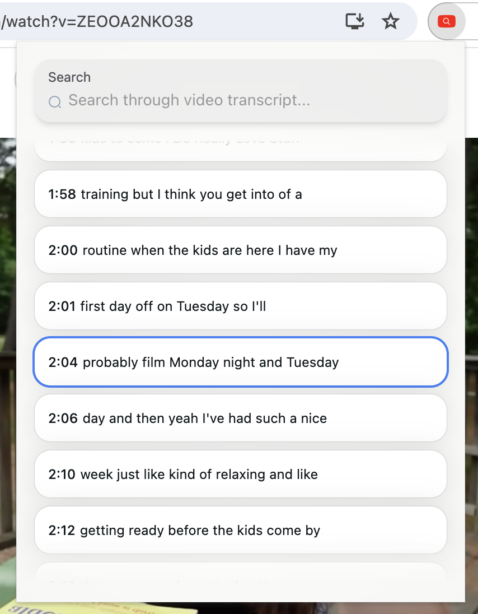
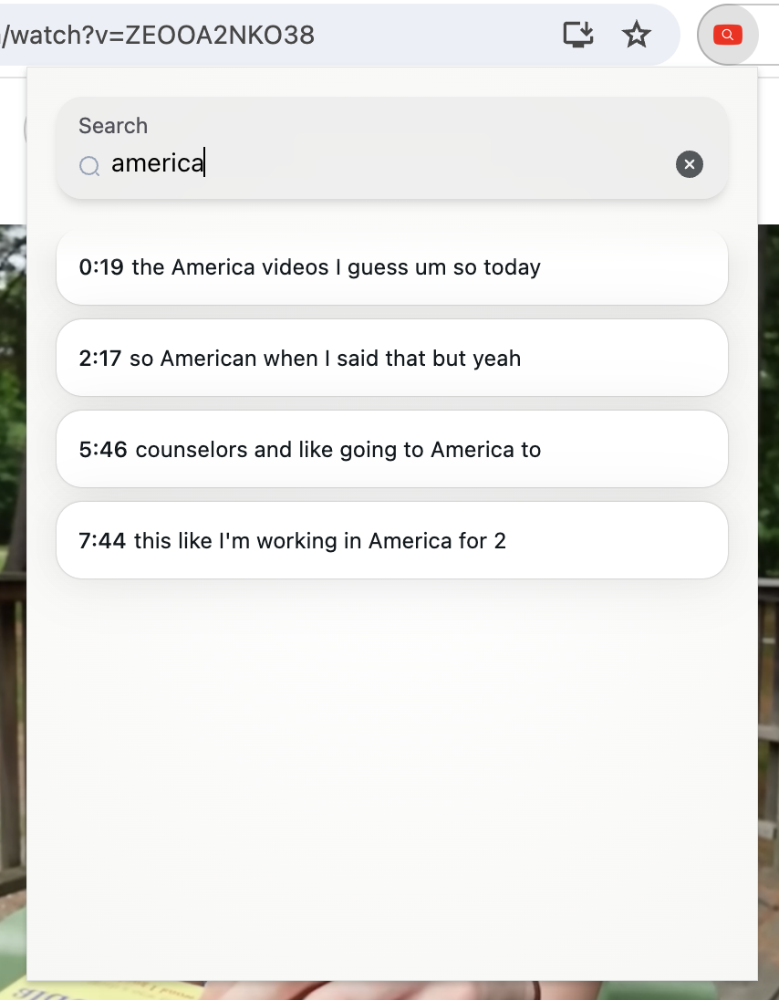

# Chrome Extension: YouTube Captions Search

Handy took for research. Easily search for keywords in the YouTube captions!

## Features

- Auto scrolls to the active caption
- Search for keywords to filter captions
- Click on a caption in the popup to skip to the corresponding part in the video






## Installation

- Clone/download this repository
- On chrome, type chrome://extensions/ in the search bar
- Turn on developer mode
- Click "Load unpacked", and upload the ```build``` folder

## Tech stack

Built with React and TypeScript.
